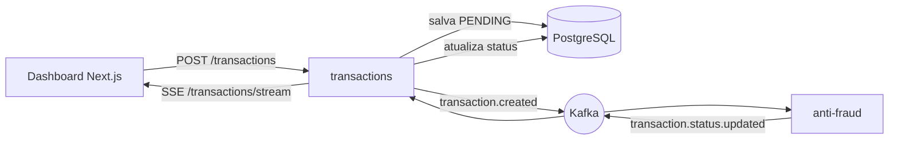

# BIUD Tech Challenge — Transações

Solução para o desafio fullstack da BIUD: uma arquitetura **orientada a eventos** com dois
microserviços conversando por **Kafka** e um **dashboard** que reflete a mudança de status em
tempo real.

Toda transação nasce **pendente**, é avaliada de forma assíncrona pelo antifraude e passa a
**aprovada** ou **rejeitada** — a regra é: valor **acima de 1000 é rejeitado**, o resto é aprovado.



## Stack

- **Monorepo**: pnpm workspaces + Turborepo
- **Backend**: NestJS + Prisma + PostgreSQL; Kafka via `@nestjs/microservices` (kafkajs)
- **Frontend**: Next.js (App Router) + Tailwind + TanStack Query; tempo real por SSE (`EventSource`)
- **Contratos**: pacote `@biud/contracts` com tipos de eventos, tópicos e status compartilhados
- **Testes**: Jest (backend) e Vitest + Testing Library (frontend)
- **Qualidade**: ESLint, Prettier, Husky + lint-staged, commitlint (Conventional Commits), CI no GitHub Actions

## Estrutura

```
apps/
  transactions/   API HTTP + Prisma + produtor/consumidor Kafka + stream SSE
  anti-fraud/     microserviço Kafka: aplica a regra e publica o resultado
  web/            dashboard Next.js (listagem, criação e detalhe)
packages/
  contracts/      tipos compartilhados (eventos, tópicos, status)
```

## Pré-requisitos

- **Node 22+** e **pnpm** (`corepack enable pnpm`)
- **Docker** (Postgres + Kafka + Kafka UI via `docker-compose.yml`)

## Como rodar

```bash
pnpm install
cp .env.example .env
pnpm stack
```

`pnpm stack` sobe a infraestrutura (aguardando ficar saudável), prepara o banco
(`prisma generate` + `migrate deploy` + `seed`) e liga os três serviços juntos. `Ctrl+C` derruba
todos. Em partes: `pnpm services:up`, `pnpm db:setup`, `pnpm dev` (e `pnpm services:down`).

| Serviço      | URL                     |
| ------------ | ----------------------- |
| Dashboard    | http://localhost:3000   |
| API (Swagger)| http://localhost:3001/docs |
| Kafka UI     | http://localhost:8080   |

## Como testar

```bash
pnpm quality
```

Roda o gate completo: `lint`, `typecheck`, `test`, `build` e checagem de formatação, orquestrados
pelo Turborepo. Passos isolados: `pnpm lint`, `pnpm typecheck`, `pnpm test`, `pnpm build`,
`pnpm format:check`.

**Fluxo ponta a ponta:** crie uma transação com `value: 120` → nasce **Pendente** e vira
**Aprovada** em segundos, sem recarregar; com `value: 2000` → **Rejeitada**. Dá para acompanhar os
eventos pelo Kafka UI.

## Endpoints (transactions)

- `POST /transactions` — cria a transação (nasce pendente) e publica `transaction.created`
- `GET /transactions` — listagem paginada com filtros (status, tipo, período)
- `GET /transactions/:transactionExternalId` — detalhe (ou 404)
- `GET /transactions/stream` — SSE com as mudanças de status

## Decisões e escopo

As decisões de arquitetura — com alternativas consideradas e o porquê — estão em
[DECISIONS.md](./DECISIONS.md), incluindo a **resposta de escala** para alto volume. Os requisitos
do desafio estão em [PRACTICES.md](./PRACTICES.md).

**Fora de escopo (documentado como evolução):** DLQ para mensagens venenosas, paginação por cursor,
e fan-out do SSE via Redis para múltiplas instâncias — todos com o gancho já deixado no código.

---

Desenvolvido por **Pedro Lima** para o Tech Challenge BIUD.
